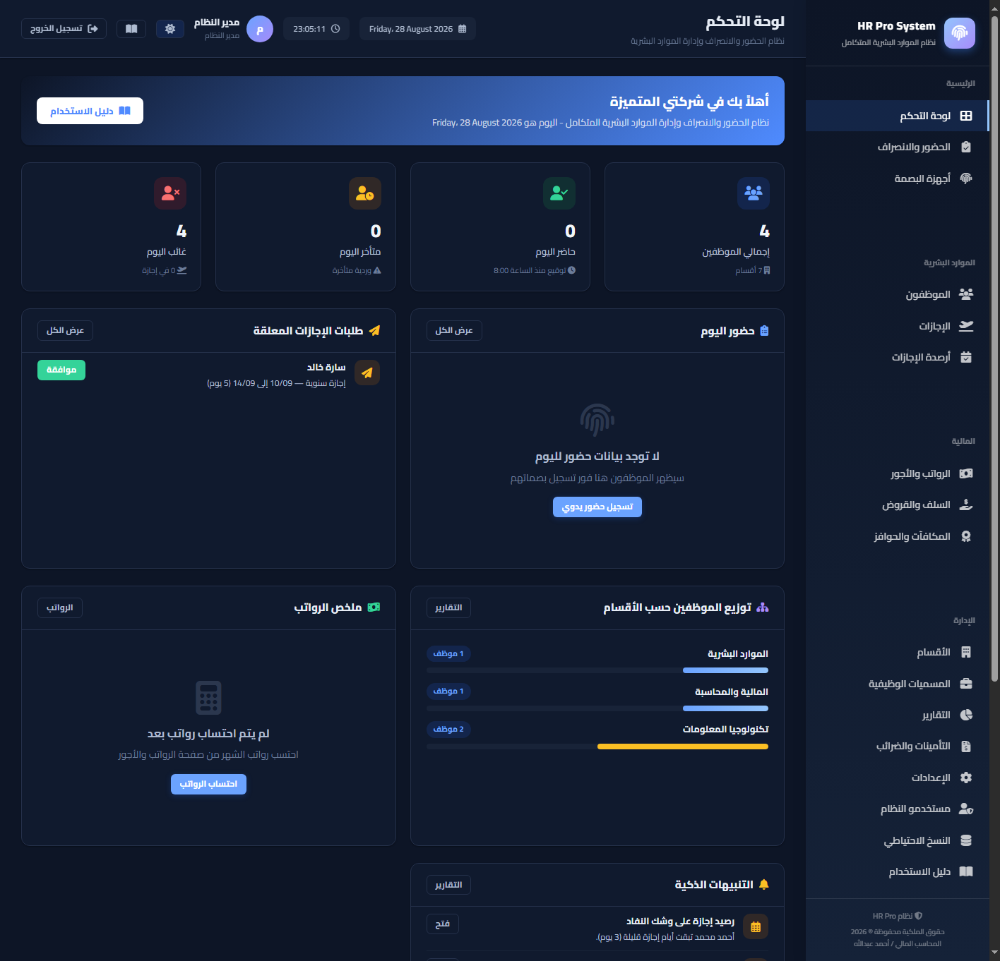
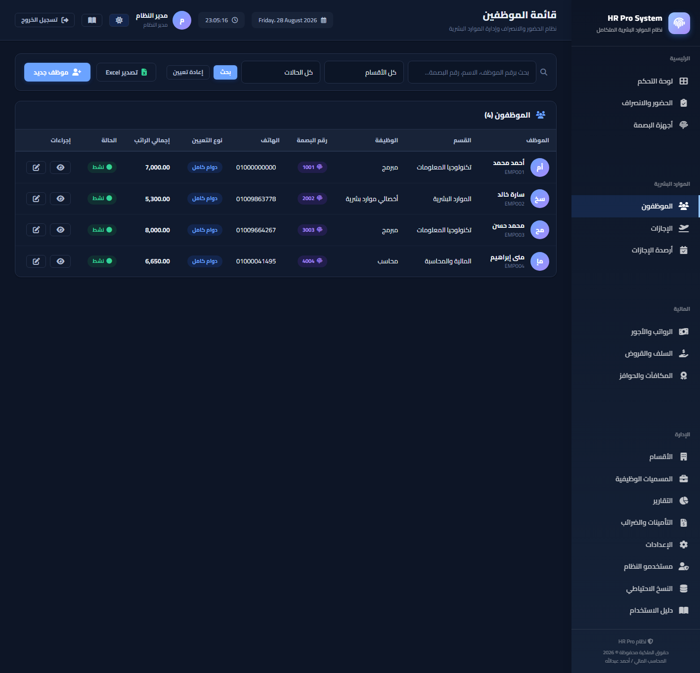
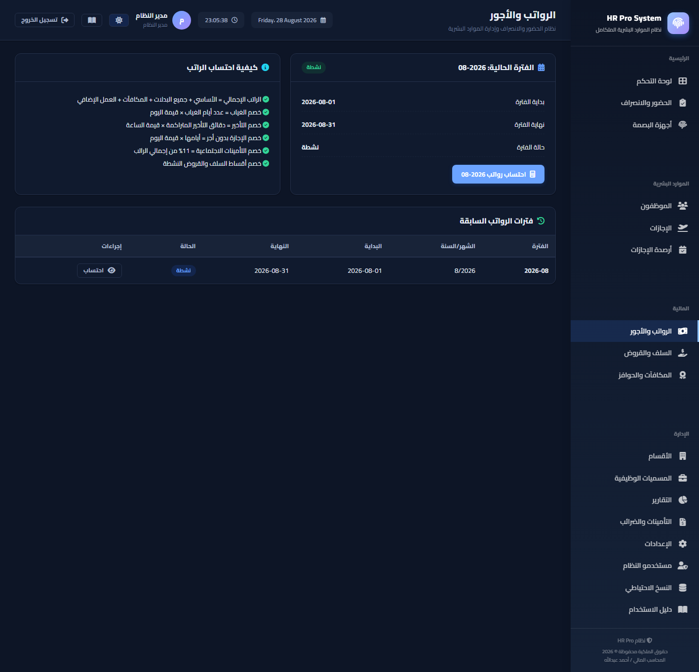
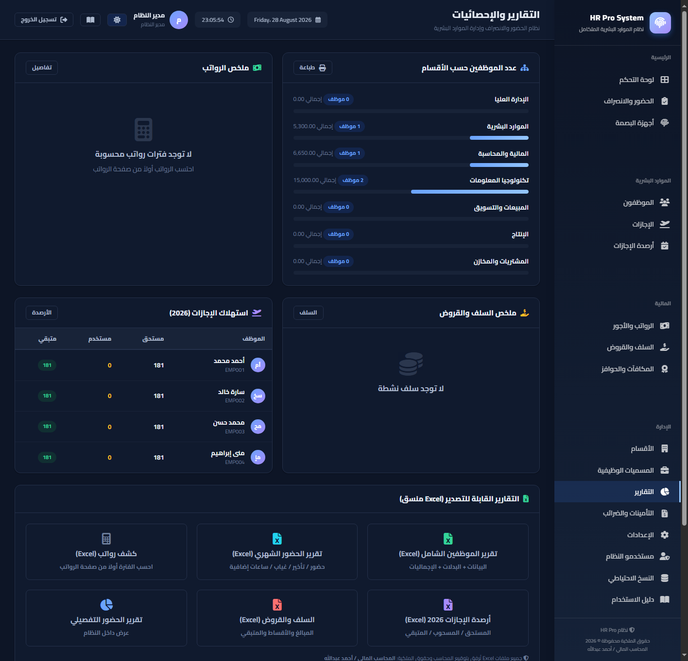
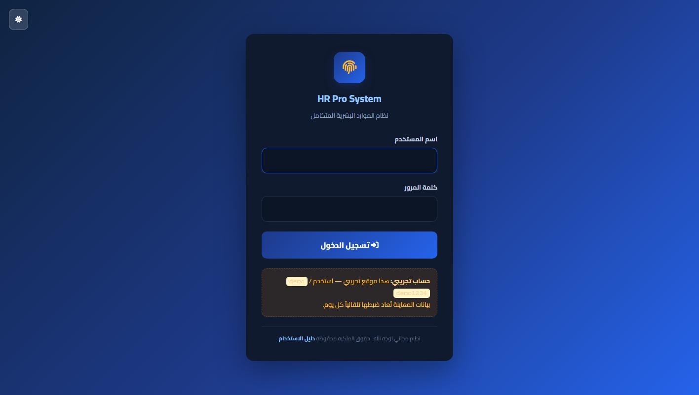
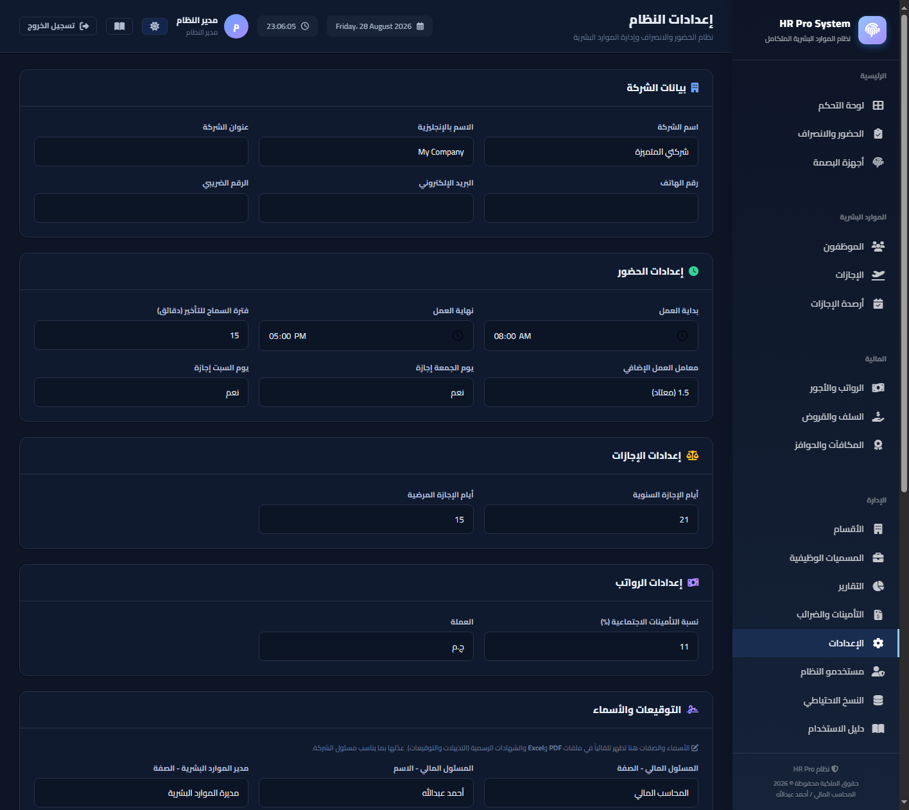
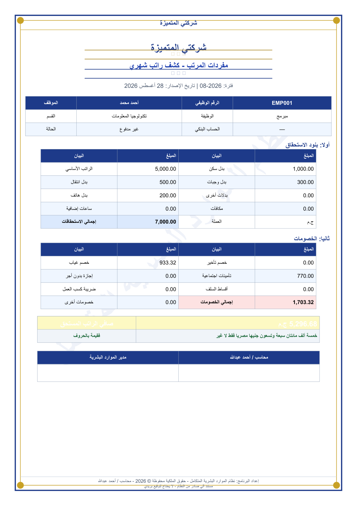
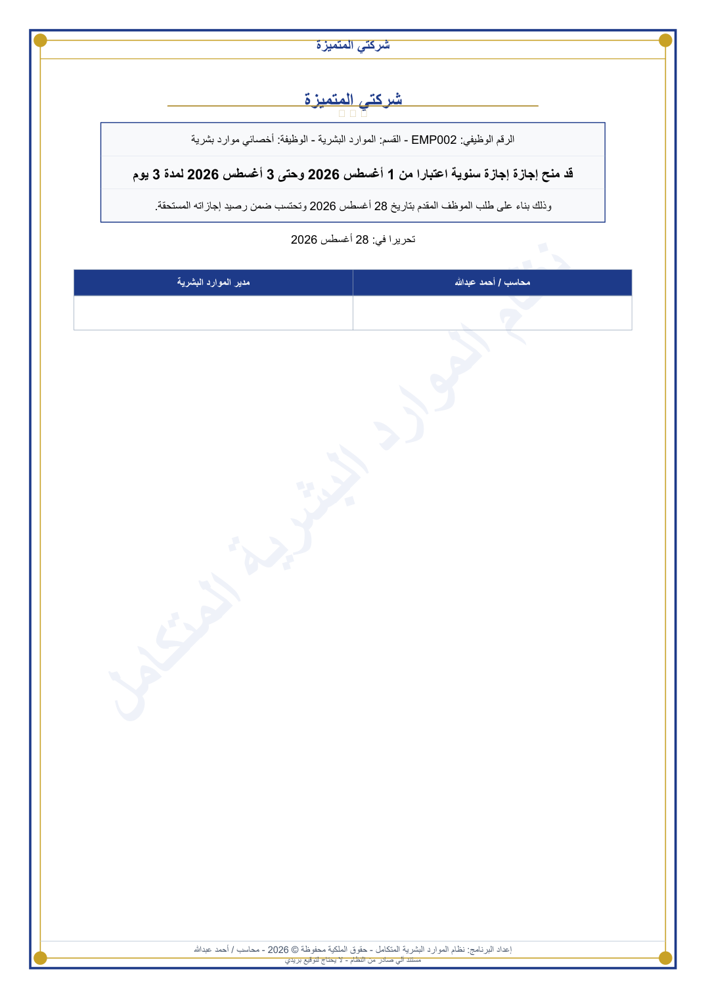
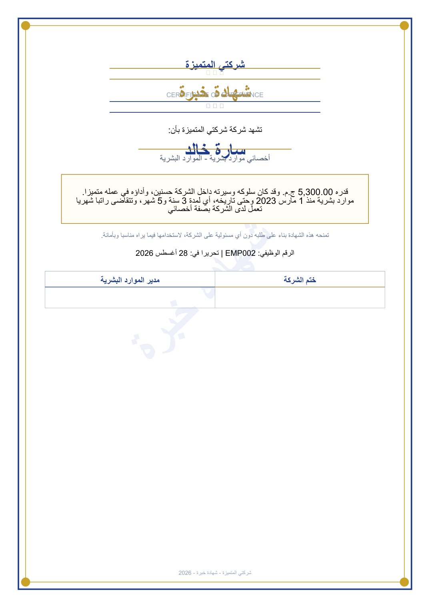
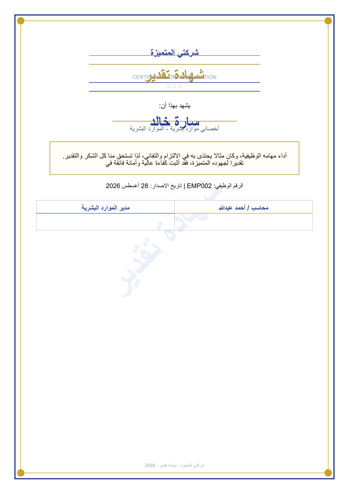

# HR Pro System - نظام الموارد البشرية المتكامل

نظام إدارة موارد بشرية متكامل **باللغة العربية، مجاني، لوجه الله** — يعمل محلياً على ويندوز بدون إنترنت، ويمكن نشره على استضافة عامة للتجربة.

<p align="center">
  
</p>

## ✨ أبرز المميزات

| المجال | المميزات |
|---|---|
| 🧑‍💼 الموظفون | ملفات كاملة (بيانات، راتب، إجازات، سلف، بنك) + الحفاظ على الهوية البصرية |
| 🖐️ البصمة والحضور | واجهة API لأجهزة البصمة على الشبكة الداخلية، تأخير/غياب/إجازة، استيراد CSV، رسم الغياب التلقائي نهاية اليوم |
| 📅 الإجازات | أنواع وأرصدة وطلبات بالموافقة + شهادات إجازة رسمية |
| 💰 الرواتب | فترات رواتب، احتساب تلقائي (إضافي/خصومات/تأمينات/ضريبة/سلف)، **مفردات المرتب** لكل موظف (عرض وطباعة + تحميل **PDF و Excel**)، سلف وقروض بأقساط |
| 📊 التقارير | **Excel** و **PDF** عربي احترافي لحضور/رواتب/إجازات/سلف/تأمينات، وشهادات خبرة رسمية |
| 🏅 الشهادات | شهادات **خبرة** و **تقدير** بتصميم رسمي فاخر (إطار مزدوج وزخارف ذهبية) مع صفحة إصدار تحدد سبب التكريم |
| 🖊️ التوقيعات | قسم خاص في الإعدادات لتغيير الأسماء والصفات الظاهرة في كل ملفات PDF/Excel والشهادات |
| 🌙 المظهر | **وضع داكن فاخر** بكل الصفحات (شامل تسجيل الدخول) مع زر تبديل وحفظ تلقائي للتفضيل |
| 🔒 الأمان | CSRF شامل + مفتاح API للأجهزة + رؤوس أمان + قفل محاولات الدخول + رفع ملفات محصور + نسخ احتياطي تلقائي |
| 💾 النسخ | نسخة تلقائية يومياً 2:00 ص (آخر 30 نسخة) + استعادة بنسخة أمانة |
| 🔔 تنبيهات | لوحة ذكية (نفاد رصيد، غياب متكرر، بدون بصمة، سلف متأخرة، فترة غير محسوبة) |
| 📖 دليل | دليل استخدام عربي كامل من داخل النظام (23 قسماً + نوتة ربط أجهزة الشبكة) |

## 🚀 التشغيل على جهازك (ويندوز)

**الطريقة السريعة (بايثون مثبّت):**
```bat
install.bat     :: تثبيت المتطلبات في بيئة افتراضية (مرة واحدة)
start_silent.bat :: تشغيل صامت + فتح المتصفح تلقائياً على http://127.0.0.1:8080
```

**يدوياً:**
```bash
pip install -r requirements.txt
python init_db.py
python run_server.py
```

> 🔑 الحسابات الافتراضية (محلياً فقط): `admin / admin123` (مدير) و `hr / hr123`.

## 🔗 ربط الأجهزة على الشبكة

**فكرة واحدة:** نظام واحد + قاعدة بيانات واحدة على **جهاز رئيسي**، وباقي الأجهزة تستخدمه من المتصفح فقط (لا تثبيت). الحالتان:
- **أجهزة قريبة (نفس الراوتر):** جهاز رئيسي يشغّل `start_network.bat` (يعرض العنوان `http://<IP>:8080` ويضيف قاعدة جدار الحماية تلقائياً)، والأجهزة الأخرى تفتح `connect_client.bat` وتدخل العنوان.
- **فروع بعيدة الأماكن:** الجهاز الرئيسي يبقى النواة، ويصل إليه الفروع عبر رابط عام — `نفق_للخارج.bat` (Cloudflare سريع مؤقت) أو نشر DEMO على Render دائم لا يوقف بجهازك، أو VPN للاتصال الداخلي.

شرح كامل (عنوان IP، جدار الحماية، أجهزة البصمة بالنواذ البعيدة، حل المشاكل) في **`نوتة_ربط_الاجهزة.md`**، ومن داخل النظام عبر قسم **«ربط الأجهزة على الشبكة»** في دليل الاستخدام.

## 🌐 نسخة تجريبية عامة (Demo)

هناك **وضع ديمو** مخصص للنشر العام: بدون حسابات admin، حساب تجريبي واحد، بيانات معاينة تُعاد تلقائياً يومياً، ورفع محدود:

```bash
set DEMO_MODE=1 && python run_server.py   # أو start_demo.bat
```
حساب الدخول التجريبي: `demo / demo1234`

### 🎥 إتاحة العرض للجمهور من أي مكان (رابط عام)

- **أثناء جهازك شغال:** شغّل `عرض_عام_تشغيل.bat` — يفتح نسخة ديمو معزولة آمنة + نفق Cloudflare، ويُظهر لك رابطاً عاماً (مثل `https://xxxx.trycloudflare.com`) توزّعه. الرابط يظل شغالاً ما دام جهازك والنافذة يعملان.
- **عرض دائم حتى مع إغلاق جهازك:** فقط النشر السحابي — انشر على **Render** مجاناً (زر واحد، انظر قسم النشر بالأسفل) فيبقى النظام 24/7 بلا جهازك.
- Security warning: النفق العام يمر عبر نسخة DEMO معزولة فقط، ولا يتصل البتة بخادم البيانات الحقيقي (8080).

## ☁️ نَشْر تجريبي على Render (مجاني - زر واحد)

1. ارفع هذا المشروع على GitHub (مستودع عام).
2. في Render: **New → Blueprint** → الصق رابط المستودع →
3. Render يقرأ `render.yaml` تلقائياً وينشئ خدمة ويب مجانية مضبوطة (DEMO_MODE مفعّل، HTTPS، مفتاح سري مولّد).

للنشر يدوياً على **PythonAnywhere**: حمّل المشروع، أنشئ venv، ثبّت `requirements.txt`، واجعل WSGI يشير إلى `app.py`، مع متغير `DEMO_MODE=1`.

## 🛠️ الترتيب مع التطبيق المحلي

- قاعدة البيانات: `hr_system.db` (SQLite) — تُولّد تلقائياً.
- النسخ الاحتياطي: مجلد `backups/`.
- إعدادات الأمان والتوقيعات: من لوحة **الإعدادات** مباشرة.

## 📸 لقطات من النظام

| | |
|---|---|
|  |  |
|  |  |
|  |  |

معاينات من ملفات **PDF العربية** المولّدة:

<p align="center">
  
  
  
  
</p>

## ⚠️ ملاحظات أمان

- عند النشر العام فعّل `DEMO_MODE=1` و `SESSION_COOKIE_SECURE=1` وضَع `SECRET_KEY` بيئة.
- لا ترفع `hr_system.db` أو `secret.key` إلى المستودع (مستبعدة بـ `.gitignore`).

## 📄 الترخيص

MIT — مجاني بالكامل لوجه الله، يُسمح باستخدامه وتعديله لأي غرض مع إبقاء حقوق المؤلف.

مُعد بواسطة: **محاسب / أحمد عبدالله**.